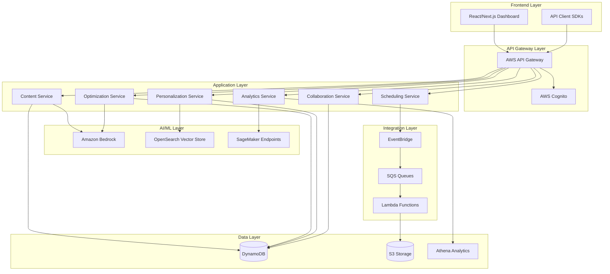

# CREO AI Platform Design Document

## Overview

CREO AI is a serverless, cloud-native platform built on AWS that provides end-to-end content lifecycle management through artificial intelligence. The system employs a microservices architecture with event-driven communication, enabling independent scaling and development of core features including content generation, optimization, personalization, distribution, and analytics.

The platform serves multiple user types through a unified React-based dashboard while providing programmatic access via RESTful APIs. The architecture prioritizes scalability, security, and real-time performance through AWS managed services and serverless computing patterns.

## Architecture

### High-Level Architecture



### Service Architecture Patterns

The platform follows Domain-Driven Design principles with bounded contexts for each major capability:

- **Content Domain**: Handles content creation, storage, and versioning
- **Optimization Domain**: Manages AI-powered content enhancement and prediction
- **Personalization Domain**: Processes user behavior and generates personalized recommendations
- **Distribution Domain**: Orchestrates cross-platform publishing and scheduling
- **Analytics Domain**: Collects, processes, and analyzes content performance data
- **Collaboration Domain**: Manages real-time editing, comments, and workflow approvals

## Components and Interfaces

### Core Services

#### Content Generation Service
- **Purpose**: AI-powered content creation using Amazon Bedrock
- **Key Functions**: 
  - Generate platform-specific content (blogs, captions, scripts, ads)
  - Maintain thematic consistency across variations
  - Support multiple content formats and styles
- **Interfaces**: REST API, WebSocket for real-time generation status
- **Dependencies**: Amazon Bedrock (Claude/GPT models), DynamoDB for content storage

#### Content Optimization Service
- **Purpose**: Enhance content performance through AI analysis
- **Key Functions**:
  - Analyze hooks, headlines, hashtags for improvement opportunities
  - Predict engagement rates with confidence intervals
  - Provide explainable recommendations
- **Interfaces**: REST API with batch processing capabilities
- **Dependencies**: Amazon Bedrock for analysis, historical performance data from Analytics Service

#### Personalization Service
- **Purpose**: Adapt content based on audience behavior and preferences
- **Key Functions**:
  - Generate and maintain user embeddings
  - Create audience segments based on behavior patterns
  - Personalize content for specific segments
- **Interfaces**: REST API, real-time recommendation endpoints
- **Dependencies**: OpenSearch for vector storage, DynamoDB for user profiles

#### Cross-Platform Distribution Service
- **Purpose**: Automate content publishing across multiple platforms
- **Key Functions**:
  - Schedule content based on optimal timing algorithms
  - Adapt content format for platform requirements
  - Handle publication retries and error notifications
- **Interfaces**: REST API, EventBridge integration for scheduling
- **Dependencies**: Platform APIs (Twitter, Facebook, LinkedIn, etc.), EventBridge, SQS

#### Analytics and Insights Service
- **Purpose**: Process performance data and generate actionable insights
- **Key Functions**:
  - Collect engagement metrics from multiple platforms
  - Generate performance reports and trend analysis
  - Provide AI-driven content improvement recommendations
- **Interfaces**: REST API, real-time dashboards via WebSocket
- **Dependencies**: AWS Glue for ETL, Athena for querying, SageMaker for ML insights

#### Collaboration Service
- **Purpose**: Enable real-time team collaboration on content
- **Key Functions**:
  - Real-time collaborative editing with operational transforms
  - Comment threading and approval workflows
  - Version control and change attribution
- **Interfaces**: WebSocket for real-time updates, REST API for workflow management
- **Dependencies**: DynamoDB for document state, ElastiCache for session management

### External Integrations

#### Social Media Platform APIs
- **Supported Platforms**: Twitter, Facebook, Instagram, LinkedIn, TikTok, YouTube
- **Integration Pattern**: OAuth 2.0 authentication, rate-limited API calls
- **Error Handling**: Exponential backoff, circuit breaker pattern

#### AI/ML Services
- **Amazon Bedrock**: Primary LLM provider for content generation and analysis
- **OpenSearch**: Vector database for semantic search and personalization
- **SageMaker**: Custom ML models for engagement prediction and content scoring

## Data Models

### Core Entities

#### User
```typescript
interface User {
  userId: string;
  email: string;
  profile: UserProfile;
  subscription: SubscriptionTier;
  preferences: UserPreferences;
  createdAt: Date;
  lastActiveAt: Date;
}

interface UserProfile {
  displayName: string;
  avatar?: string;
  timezone: string;
  language: string;
}

interface UserPreferences {
  defaultPlatforms: Platform[];
  contentTypes: ContentType[];
  aiAssistanceLevel: 'minimal' | 'moderate' | 'aggressive';
}
```

#### Content
```typescript
interface Content {
  contentId: string;
  userId: string;
  title: string;
  body: string;
  contentType: ContentType;
  targetPlatforms: Platform[];
  status: ContentStatus;
  metadata: ContentMetadata;
  versions: ContentVersion[];
  createdAt: Date;
  updatedAt: Date;
}

interface ContentMetadata {
  tags: string[];
  audienceSegments: string[];
  scheduledPublishTime?: Date;
  aiGenerationParams?: AIGenerationParams;
}

interface ContentVersion {
  versionId: string;
  changes: string;
  author: string;
  timestamp: Date;
}
```

#### Audience Segment
```typescript
interface AudienceSegment {
  segmentId: string;
  userId: string;
  name: string;
  description: string;
  criteria: SegmentCriteria;
  userEmbeddings: number[];
  size: number;
  engagementPatterns: EngagementPattern[];
  createdAt: Date;
}

interface SegmentCriteria {
  demographics?: DemographicFilter;
  behaviorPatterns?: BehaviorFilter;
  engagementHistory?: EngagementFilter;
}
```

#### Performance Analytics
```typescript
interface ContentPerformance {
  contentId: string;
  platform: Platform;
  metrics: EngagementMetrics;
  timestamp: Date;
  audienceReach: number;
  conversionEvents: ConversionEvent[];
}

interface EngagementMetrics {
  views: number;
  likes: number;
  shares: number;
  comments: number;
  clickThroughRate: number;
  engagementRate: number;
}
```

### Database Schema Design

#### DynamoDB Tables

**Users Table**
- Partition Key: `userId`
- GSI: `email-index` for login lookups
- TTL: Not applicable (permanent storage)

**Content Table**
- Partition Key: `userId`
- Sort Key: `contentId`
- GSI: `status-index` for filtering by content status
- GSI: `platform-index` for platform-specific queries

**Analytics Table**
- Partition Key: `contentId`
- Sort Key: `timestamp`
- GSI: `userId-timestamp-index` for user analytics
- TTL: 2 years for data retention compliance

**Collaboration Table**
- Partition Key: `contentId`
- Sort Key: `sessionId`
- GSI: `userId-index` for user activity tracking
- TTL: 30 days for session cleanup

## Correctness Properties

*A property is a characteristic or behavior that should hold true across all valid executions of a system—essentially, a formal statement about what the system should do. Properties serve as the bridge between human-readable specifications and machine-verifiable correctness guarantees.*

### Property Reflection

After analyzing all 45 acceptance criteria, I identified several areas where properties can be consolidated to eliminate redundancy:

**Consolidation Opportunities:**
- Properties 1.1-1.5 (content generation) can be combined into comprehensive generation properties
- Properties 2.1-2.5 (optimization) can be consolidated into optimization correctness properties  
- Properties 3.1-3.5 (personalization) can be unified into personalization behavior properties
- Properties 4.1-4.5 (distribution) can be combined into distribution reliability properties
- Properties 5.1-5.5 (analytics) can be consolidated into analytics processing properties
- Properties 6.1-6.5 (dashboard) can be unified into interface consistency properties
- Properties 7.1-7.5 (security/scalability) can be combined into system reliability properties
- Properties 8.1-8.5 (collaboration) can be consolidated into collaboration functionality properties
- Properties 9.1-9.5 (API) can be unified into API consistency properties

This consolidation reduces 45 individual criteria into 15 comprehensive properties that provide unique validation value without redundancy.

### Core Correctness Properties

**Property 1: Content Generation Consistency**
*For any* valid platform and content parameters, the AI_Engine should generate platform-optimized content within timing requirements while maintaining thematic consistency and providing multiple variations
**Validates: Requirements 1.1, 1.2, 1.3, 1.4, 1.5**

**Property 2: Optimization Enhancement Preservation**
*For any* content submitted for optimization, the Content_Optimizer should provide timely suggestions with explanations and confidence intervals while preserving original intent
**Validates: Requirements 2.1, 2.2, 2.3, 2.4, 2.5**

**Property 3: Personalization Consistency**
*For any* audience data and segment targeting, the personalization system should generate appropriate user embeddings and segment-specific content while maintaining brand consistency
**Validates: Requirements 3.1, 3.2, 3.3, 3.4, 3.5**

**Property 4: Distribution Reliability**
*For any* content scheduled for distribution, the Cross_Platform_Publisher should handle platform-specific formatting, optimal timing, status updates, and failure recovery correctly
**Validates: Requirements 4.1, 4.2, 4.3, 4.4, 4.5**

**Property 5: Analytics Processing Completeness**
*For any* content performance data, the Analytics_Engine should process metrics within timing requirements and generate insights with explanations, trends, and recommendations
**Validates: Requirements 5.1, 5.2, 5.3, 5.4, 5.5**

**Property 6: Dashboard Interface Consistency**
*For any* dashboard access, the interface should display all required information elements with proper access controls, real-time updates, and workflow tracking
**Validates: Requirements 6.1, 6.2, 6.3, 6.4, 6.5**

**Property 7: System Security and Scalability**
*For any* system operation, the platform should maintain encryption, access controls, audit logging, auto-scaling, and availability requirements
**Validates: Requirements 7.1, 7.2, 7.3, 7.4, 7.5**

**Property 8: Collaboration Functionality**
*For any* collaborative editing session, the system should provide real-time editing, conflict resolution, approval workflows, presence indicators, and version control
**Validates: Requirements 8.1, 8.2, 8.3, 8.4, 8.5**

**Property 9: API Consistency**
*For any* API interaction, the system should provide proper authentication, documentation, rate limiting, webhook support, and consistent response formatting
**Validates: Requirements 9.1, 9.2, 9.3, 9.4, 9.5**

## Error Handling

### Error Classification and Response Strategies

#### AI Service Errors
- **LLM Rate Limiting**: Implement exponential backoff with jitter, queue requests during peak usage
- **Content Generation Failures**: Provide fallback templates, retry with different model parameters
- **Embedding Generation Errors**: Use cached embeddings when available, graceful degradation to rule-based personalization

#### Platform Integration Errors
- **API Rate Limits**: Respect platform-specific rate limits, implement intelligent queuing
- **Authentication Failures**: Automatic token refresh, user notification for manual re-authentication
- **Platform Outages**: Queue content for retry, provide status updates to users

#### Data Consistency Errors
- **Concurrent Edit Conflicts**: Operational transform algorithms for real-time collaboration
- **Version Control Issues**: Maintain immutable version history, provide conflict resolution UI
- **Analytics Data Gaps**: Interpolate missing data points, flag incomplete datasets

#### System-Level Errors
- **Service Unavailability**: Circuit breaker pattern, graceful degradation to cached responses
- **Database Failures**: Multi-region replication, automatic failover with minimal data loss
- **Memory/Compute Limits**: Auto-scaling triggers, request queuing during resource constraints

### Error Recovery Patterns

#### Retry Strategies
```typescript
interface RetryConfig {
  maxAttempts: number;
  baseDelay: number;
  maxDelay: number;
  backoffMultiplier: number;
  jitterEnabled: boolean;
}

// Example: AI service calls
const aiServiceRetry: RetryConfig = {
  maxAttempts: 3,
  baseDelay: 1000,
  maxDelay: 10000,
  backoffMultiplier: 2,
  jitterEnabled: true
};
```

#### Circuit Breaker Implementation
- **Failure Threshold**: 5 consecutive failures trigger circuit open
- **Recovery Timeout**: 30 seconds before attempting recovery
- **Health Check**: Lightweight requests to test service availability

## Testing Strategy

### Dual Testing Approach

The CREO AI platform requires both unit testing and property-based testing to ensure comprehensive coverage and correctness validation.

#### Unit Testing Requirements

Unit tests will focus on:
- **Specific Examples**: Test concrete scenarios like generating a Twitter post for a specific user segment
- **Edge Cases**: Handle empty content, invalid platform parameters, network timeouts
- **Integration Points**: Verify service boundaries and data transformation between components
- **Error Conditions**: Validate proper error handling and user notification flows

**Testing Framework**: Jest with TypeScript support for backend services, React Testing Library for frontend components

**Coverage Targets**: 
- Core business logic: 90% line coverage
- API endpoints: 100% path coverage
- Error handling: 85% branch coverage

#### Property-Based Testing Requirements

Property-based tests will verify universal properties across all inputs using **fast-check** library for JavaScript/TypeScript.

**Configuration Requirements**:
- Minimum 100 iterations per property test to ensure statistical confidence
- Custom generators for domain-specific data (content types, platform specifications, user segments)
- Shrinking enabled to find minimal failing examples

**Property Test Tagging**:
Each property-based test MUST include a comment with this exact format:
```typescript
// **Feature: creo-ai-platform, Property 1: Content Generation Consistency**
```

**Core Property Tests**:

1. **Content Generation Properties**
   - Generated content always matches platform specifications
   - Multiple variations maintain thematic consistency
   - Generation timing remains within SLA bounds

2. **Optimization Properties**
   - Optimization suggestions preserve content intent
   - Confidence intervals are mathematically valid
   - Suggestion rankings correlate with predicted impact

3. **Personalization Properties**
   - User embeddings accurately represent behavior patterns
   - Personalized content maintains brand consistency
   - Segment targeting produces appropriate variations

4. **Distribution Properties**
   - Platform formatting meets technical requirements
   - Scheduling respects optimal timing recommendations
   - Retry logic handles failures appropriately

5. **Analytics Properties**
   - Performance insights explain contributing factors
   - Trend identification spans multiple dimensions
   - Recommendations reflect historical patterns

**Generator Strategy**:
- **Smart Constraints**: Generate realistic content parameters within valid ranges
- **Platform-Aware**: Respect platform-specific limitations and requirements
- **User-Behavior Modeling**: Generate realistic user interaction patterns
- **Performance-Aware**: Include timing and resource constraints in test scenarios

### Integration Testing

#### API Contract Testing
- **OpenAPI Specification**: Maintain comprehensive API documentation with examples
- **Contract Validation**: Ensure API responses match documented schemas
- **Backward Compatibility**: Validate that API changes don't break existing integrations

#### End-to-End Workflow Testing
- **Content Lifecycle**: Test complete flow from creation to analytics
- **Multi-User Scenarios**: Validate collaboration features under concurrent usage
- **Platform Integration**: Test actual publishing to sandbox environments

### Performance Testing

#### Load Testing Scenarios
- **Content Generation**: 1000 concurrent generation requests
- **Real-time Collaboration**: 50 users editing simultaneously
- **Analytics Processing**: Batch processing of 1M engagement events

#### Scalability Validation
- **Auto-scaling Triggers**: Verify scaling occurs within performance thresholds
- **Resource Utilization**: Monitor memory and CPU usage under load
- **Database Performance**: Query optimization and connection pooling effectiveness

## Security Architecture

### Authentication and Authorization

#### Multi-Tenant Security Model
- **User Authentication**: AWS Cognito with MFA support, social login integration
- **API Authentication**: JWT tokens with refresh token rotation
- **Service-to-Service**: IAM roles with least-privilege access policies
- **External Platform Auth**: OAuth 2.0 with secure token storage in AWS Secrets Manager

#### Role-Based Access Control (RBAC)
```typescript
enum UserRole {
  VIEWER = 'viewer',
  CREATOR = 'creator', 
  EDITOR = 'editor',
  ADMIN = 'admin',
  OWNER = 'owner'
}

interface Permission {
  resource: string;
  actions: string[];
  conditions?: AccessCondition[];
}

// Example permissions
const creatorPermissions: Permission[] = [
  { resource: 'content', actions: ['create', 'read', 'update'] },
  { resource: 'analytics', actions: ['read'] },
  { resource: 'collaboration', actions: ['comment', 'suggest'] }
];
```

### Data Protection

#### Encryption Strategy
- **Data in Transit**: TLS 1.3 for all API communications, certificate pinning for mobile apps
- **Data at Rest**: AES-256 encryption for DynamoDB and S3, AWS KMS for key management
- **Application-Level**: Field-level encryption for PII data, tokenization for sensitive content

#### Privacy Compliance
- **GDPR Compliance**: Right to erasure, data portability, consent management
- **Data Retention**: Automated deletion policies, audit trail preservation
- **Cross-Border Data**: Regional data residency options, compliance with local regulations

### Security Monitoring

#### Threat Detection
- **AWS GuardDuty**: Anomaly detection for suspicious API activity
- **CloudTrail**: Comprehensive audit logging for all AWS service interactions
- **Custom Monitoring**: Real-time alerts for unusual content generation patterns

#### Incident Response
- **Automated Response**: Lambda functions for immediate threat mitigation
- **Escalation Procedures**: Integration with PagerDuty for critical security events
- **Forensic Capabilities**: Immutable log storage for security investigations

## Scalability and Performance

### Auto-Scaling Architecture

#### Compute Scaling
- **Lambda Concurrency**: Reserved concurrency for critical functions, burst capacity for peak loads
- **API Gateway**: Throttling policies per user tier, caching for frequently accessed data
- **Database Scaling**: DynamoDB on-demand billing, read replicas for analytics queries

#### Storage Scaling
- **S3 Intelligent Tiering**: Automatic cost optimization for content storage
- **CloudFront CDN**: Global content delivery for static assets and generated content
- **ElastiCache**: Redis clusters for session management and real-time collaboration

### Performance Optimization

#### Content Generation Performance
- **Model Caching**: Cache frequently used AI model responses
- **Batch Processing**: Group similar generation requests for efficiency
- **Streaming Responses**: Real-time content generation updates via WebSocket

#### Database Performance
- **Query Optimization**: GSI design for efficient access patterns
- **Connection Pooling**: RDS Proxy for database connection management
- **Caching Strategy**: Multi-layer caching with TTL-based invalidation

### Monitoring and Observability

#### Application Performance Monitoring
- **AWS X-Ray**: Distributed tracing for request flow analysis
- **CloudWatch Metrics**: Custom metrics for business KPIs and system health
- **Real User Monitoring**: Frontend performance tracking with Core Web Vitals

#### Alerting Strategy
```typescript
interface AlertConfig {
  metric: string;
  threshold: number;
  duration: number;
  severity: 'low' | 'medium' | 'high' | 'critical';
  channels: NotificationChannel[];
}

const criticalAlerts: AlertConfig[] = [
  {
    metric: 'content_generation_latency_p99',
    threshold: 30000, // 30 seconds
    duration: 300, // 5 minutes
    severity: 'critical',
    channels: ['pagerduty', 'slack']
  },
  {
    metric: 'api_error_rate',
    threshold: 0.05, // 5%
    duration: 180, // 3 minutes
    severity: 'high',
    channels: ['slack', 'email']
  }
];
```

## Deployment and DevOps

### Infrastructure as Code
- **AWS CDK**: TypeScript-based infrastructure definitions
- **Environment Management**: Separate stacks for dev, staging, production
- **Resource Tagging**: Consistent tagging strategy for cost allocation and governance

### CI/CD Pipeline

```mermaid
graph LR
    A[Code Commit] --> B[Unit Tests]
    B --> C[Integration Tests]
    C --> D[Security Scan]
    D --> E[Build & Package]
    E --> F[Deploy to Staging]
    F --> G[E2E Tests]
    G --> H[Performance Tests]
    H --> I[Deploy to Production]
    I --> J[Health Checks]
    J --> K[Rollback if Failed]
```


### Deployment Strategy
- **Blue-Green Deployment**: Zero-downtime deployments with automatic rollback
- **Feature Flags**: Gradual feature rollout with LaunchDarkly integration
- **Database Migrations**: Backward-compatible schema changes with rollback procedures

### Disaster Recovery
- **Multi-Region Setup**: Primary region (us-east-1), DR region (us-west-2)
- **RTO/RPO Targets**: 4-hour RTO, 1-hour RPO for critical data
- **Backup Strategy**: Automated daily backups with cross-region replication

## API Specifications

### RESTful API Design

#### Core Endpoints

**Content Management**
```
POST   /api/v1/content                    # Create new content
GET    /api/v1/content/{id}               # Retrieve content
PUT    /api/v1/content/{id}               # Update content
DELETE /api/v1/content/{id}               # Delete content
POST   /api/v1/content/{id}/generate      # AI content generation
POST   /api/v1/content/{id}/optimize      # Content optimization
```

**Analytics and Insights**
```
GET    /api/v1/analytics/content/{id}     # Content performance
GET    /api/v1/analytics/dashboard        # Dashboard metrics
GET    /api/v1/insights/trends            # Trend analysis
POST   /api/v1/insights/predict           # Engagement prediction
```

**Collaboration**
```
GET    /api/v1/collaboration/sessions     # Active sessions
POST   /api/v1/collaboration/join         # Join editing session
PUT    /api/v1/collaboration/cursor       # Update cursor position
POST   /api/v1/collaboration/comment      # Add comment
```

#### API Response Format
```typescript
interface APIResponse<T> {
  success: boolean;
  data?: T;
  error?: {
    code: string;
    message: string;
    details?: any;
  };
  metadata?: {
    timestamp: string;
    requestId: string;
    version: string;
  };
}
```

### WebSocket API

#### Real-time Events
```typescript
interface WebSocketMessage {
  type: 'content_update' | 'collaboration_event' | 'analytics_update';
  payload: any;
  timestamp: string;
  userId: string;
}

// Example: Real-time collaboration
interface CollaborationEvent {
  type: 'cursor_move' | 'text_insert' | 'text_delete';
  contentId: string;
  userId: string;
  position: number;
  data: string;
}
```

### Rate Limiting and Quotas

#### Tier-Based Limits
```typescript
interface RateLimits {
  contentGeneration: {
    requestsPerMinute: number;
    requestsPerDay: number;
  };
  apiCalls: {
    requestsPerSecond: number;
    requestsPerHour: number;
  };
  storage: {
    maxContentItems: number;
    maxStorageGB: number;
  };
}

const tierLimits: Record<SubscriptionTier, RateLimits> = {
  free: {
    contentGeneration: { requestsPerMinute: 5, requestsPerDay: 50 },
    apiCalls: { requestsPerSecond: 10, requestsPerHour: 1000 },
    storage: { maxContentItems: 100, maxStorageGB: 1 }
  },
  professional: {
    contentGeneration: { requestsPerMinute: 20, requestsPerDay: 500 },
    apiCalls: { requestsPerSecond: 50, requestsPerHour: 10000 },
    storage: { maxContentItems: 1000, maxStorageGB: 10 }
  },
  enterprise: {
    contentGeneration: { requestsPerMinute: 100, requestsPerDay: 5000 },
    apiCalls: { requestsPerSecond: 200, requestsPerHour: 100000 },
    storage: { maxContentItems: 10000, maxStorageGB: 100 }
  }
};
```

## Future Considerations

### Multimodal Content Support
- **Image Generation**: Integration with DALL-E or Midjourney APIs
- **Video Processing**: AWS Elemental MediaConvert for video optimization
- **Audio Content**: Text-to-speech for podcast and audio content creation

### Advanced AI Capabilities
- **Custom Model Training**: Fine-tuning models on user-specific content patterns
- **Sentiment Analysis**: Real-time sentiment tracking for brand monitoring
- **Trend Prediction**: Predictive analytics for content trend identification

### Platform Expansion
- **Mobile Applications**: React Native apps for iOS and Android
- **Browser Extensions**: Chrome/Firefox extensions for content capture and optimization
- **Desktop Applications**: Electron-based desktop apps for offline content creation

### Integration Ecosystem
- **CRM Integration**: Salesforce, HubSpot integration for lead generation tracking
- **Marketing Automation**: Marketo, Pardot integration for campaign management
- **Analytics Platforms**: Google Analytics, Adobe Analytics integration for comprehensive tracking